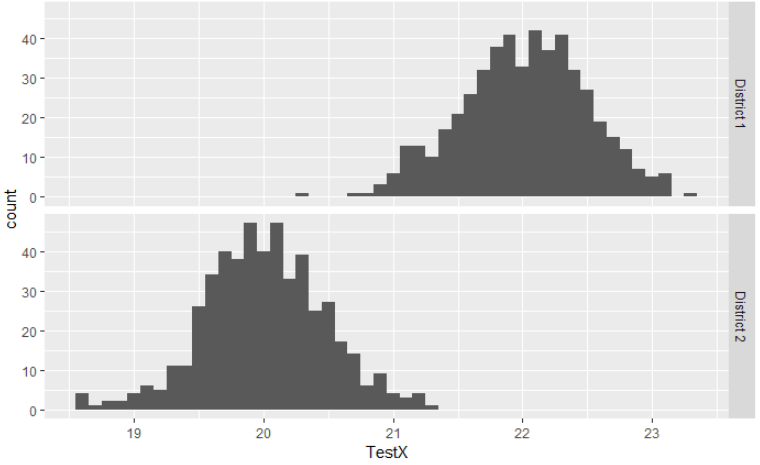
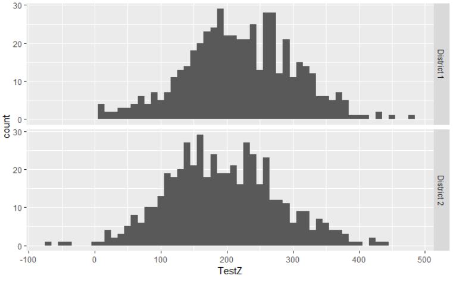
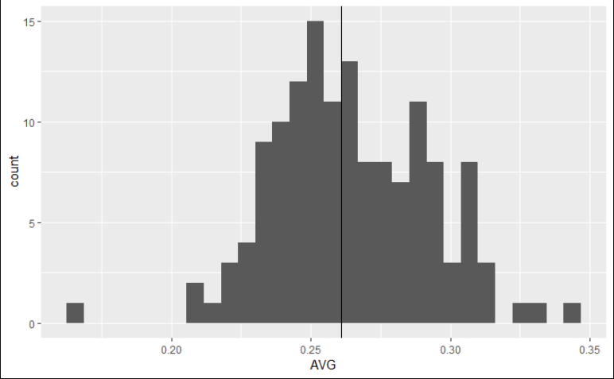

Why we need to show measures of variability in the media.

# Is it really that hard to show Standard Deviations?
-----

I understand that not everyone has ever been exposed to "sophisticated" measures of variability. Thinking back to my education, before college, I only learned about range as a measure of variability. However, I do remember learning about percentile ranks. Once I got to college and learned about standard deviations (SDs) in my first stats class, it made understanding percentile ranks even better. It wasn't until I learned about hypothesis testing that I really learned the importance of SDs. 

I see reports of group comparisons all the time in the media. It can be something as trivial as comparing a player's batting average to the league average, or something influential as a school's average on a test compared to the national or state average. These differences mean absolutlely nothing without knowledge of one and/or two things: 
*the scale of the metric and 
*the variability of the metric. 

This is where SD come into play and why they are so important. It does not matter whether or not you know the scale of the metric, the SD will still give you an idea of how small/large the difference is. Let's build on this in an example of something you may here in the media.

A news station reported that when comparing two local District Schools, District 1 scored 10% higher than District 2. Now let's be more precise and apply this difference to some actual numbers. District 2 had an average score of 20 on TestX and District 1 had an average score of 22 on TestX. This two-point difference may be of little merit and hold no substantive value. However, we need know the SD of TestX to determine the substantive significance of this two point difference. Similarly, say the average score of District 2 was 200 on TestZ, making the average score of District 1 220 on TestZ. A twenty-point difference would appear to have some substantive value, but that may not be the case. This is where discussing the merits of substantive significance become difficult without any knowledge of measures of variability, specifically Standard Deviation.

Measurement properties (variability) and study/sample characteristics (sample size) may eliminate an apparent substantive significance or conversely, indicate an apparent small difference has a lot of substantive value. Variability of a measurement will vary between different tests. For example, TestX may have an average score of 20 and a standard deviation of .5 while TestZ has an average score of 200 with a standard deviation of 80. This means that 98% of scores fall between 19-21 and 40-360 for TestX and TestZ, respectively. 

Referring back to variability and the substantive significance, the two-point difference between districts for TestX has more substantive significance than the 20-point difference for TestZ. This was a result of the variability of the different tests. In comparing the districts with TestX, District 2 would have 98% of their scores between 19 and 21 (the mean ± two times the standard deviation) while District 1 would have 98% of their scores between 21 and 23. Here, we have the top 1% of scores in District 2 overlapping with the bottom 1% of scores from District 1. In this case, there is a drastic difference in performance between the two districts and lends a high amount of substantive significance to the two-point difference. 

On the other hand, the increased variability in TestZ from above actually decreases the substantive significance for the 20-point difference. With a standard deviation of 80 for TestZ, we can expect that 98% of District 2 scores would be between 40 and 360. For District 1, we expect that 98% of the scores to between 60 and 380. For TestY, we now have the top 93% of District 2 overlapping with the bottom 93% of District 1. As one can easily tell at this point, there is considerable overlap between the two districts and the 20-point difference now has little substantive value.

We can also use the SD as a way of determing percentile ranks. However, the transferring of SD to standardized scores does not change the distribution, and using standardized scores to get percentile ranks assume a normal distribution. So this is why I think it can be even easier to report SDs and a lay-person with no experience in Statistics can understand what is going on. 

## Show Pictures

Instead of going through the explanation above about the substantive differences between the two districts, just show the below pictures.

Here is the faceted distributions for TestX:

As you can see, there is very little overlap between the two Districts. 

Here is the faceted distributions for TestZ:

Evidence here shows that even though there is a 20 point difference between the two districts, there is still considerable overlap.

Similarly, when other trivial things are being reported, like batting averages, show the distribution and highlight where the player falls. Then people would know if that .010 difference over the league average is impressive or not. 

Player Comparison to league:

Ozzie Albies from the ATL Braves is probably my favorite player in the league as of now. I like his style of play and approach to the game. Also, he hussles so much that he loses his helmet more often than not. However, despite hitting above the league average, the verticle line added shows he is not far from the average. 

I would also like to thank [FanGraphs](fangraphs.com) for doing what they do. If you are at all interested in just obtaining some data or what to learn about Sabermetrics, check them out.

## In Sum

Everything I just outlined in the first section is consicely displayed via the above images. Pictures really are worth a 1000 words, and if we can succiently showcase the importance of SD with images that take less than two minutes to generate, why don't we. I could spend a lot of time (and probably will in a later post) about statistical verse substantive significance, but that can easily be seen and understood utlizing these simple images. So instead of treating everyone as ignorant because we do not have the time to teach them inferential statistics, let's treat people like the intelligent person they are and give them as much information as possible.

I will continue to tweet various networks to provide more information, especially about variability when I see them. I encourage you to do the same. 

Cheers,
-Joe
