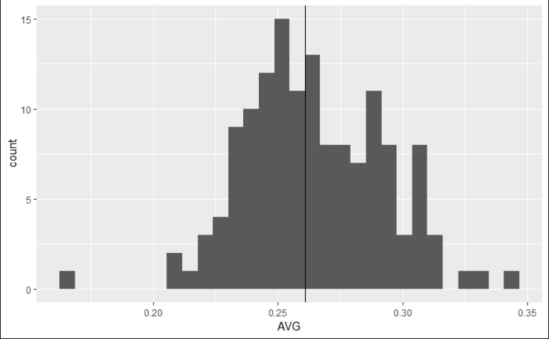

Why we need to show measures of variability in the media.  

# Part III.
-----

Part III. Be sure to check out [Part I](https://josephjonesphd.com/Variability1/) and [Part II](https://josephjonesphd.com/Variability2/) if you have not already.

Similarly, when other trivial things are being reported, like batting averages, show the distribution and highlight where the player falls. Then people would know if that .010 difference over the league average is impressive or not. 

Player Comparison to league:

Ozzie Albies from the ATL Braves is probably my favorite player in the league as of now. I like his style of play and approach to the game. Also, he hussles so much that he loses his helmet more often than not. However, despite hitting above the league average, the verticle line added shows he is not far from the average. 

I would also like to thank [FanGraphs](fangraphs.com) for doing what they do. If you are at all interested in just obtaining some data or what to learn about Sabermetrics, check them out.

## In Sum

Everything I just outlined in the first section is consicely displayed via the above images. Pictures really are worth a 1000 words, and if we can succiently showcase the importance of SD with images that take less than two minutes to generate, why don't we. I could spend a lot of time (and probably will in a later post) about statistical verse substantive significance, but that can easily be seen and understood utlizing these simple images. So instead of treating everyone as ignorant because we do not have the time to teach them inferential statistics, let's treat people like the intelligent person they are and give them as much information as possible.

I will continue to tweet various networks to provide more information, especially about variability when I see them. I encourage you to do the same. 

Cheers,
-Joe
